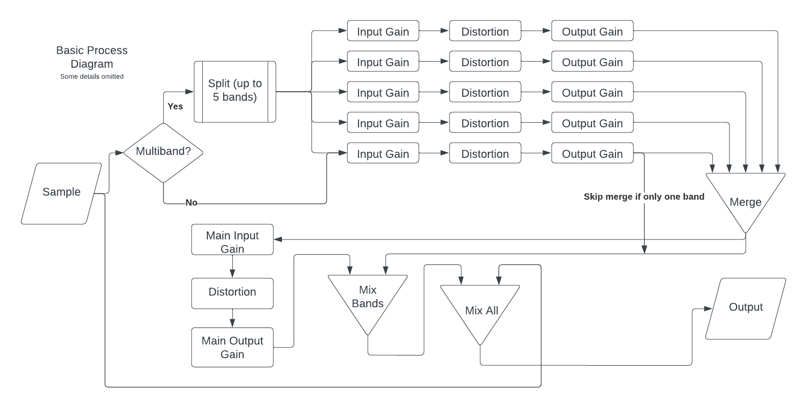

# Arraxis
 Open Source, Free, Multiband Distortion Plugin, for you!
Demo Video: https://youtu.be/G3f3SxSyPZo

If you encounter any bugs, just create an issue and I'll get around to it when I can.

Oh, also, the distortion effects really narrow the stereo space, so get [Ozone Imager](https://www.izotope.com/en/products/ozone-imager.html) to widen the stereo back up.

Feel free to modify anything, fork it, contribute, or use whatever here. Licensed under GPLv3, so that you can do exactly that.

## Features
### Up to 5 bands of distortion (yes, 5).
- Each band can be distorted with a different algorithm.
- Each band has it's own input and output gains.
- Each band has adjustable frequency cutoffs.
- Each band's distortion mix can be adjusted.

### Full-band distortion
- This distortion happens after the band-specific distortion.
- Same features as a single band, but has an extra band mix slider to mix in the final distortion.
- Dry/Wet slider to mix the original sample, and the final sample.

### 9 Distortion Types
- Normal ones like hard/soft clipping, as well as other ones like tanh or sqrt.
- More experimental ones like bitcrush, sine, and a few others.
- Epsilon slider (just chose epsilon because it sounded cool) to change the effect of the distortion. Could be as small as scaling the input value, or changing the function outright.

## Process Diagram

Enjoy this plugin!